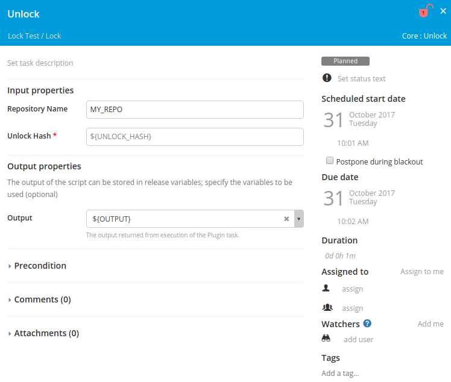

# xlr-semaphore-plugin

[![License: MIT][xlr-semaphore-plugin-license-image]][xlr-semaphore-plugin-license-url]
[![Github All Releases][xlr-semaphore-plugin-downloads-image]]()

[xlr-semaphore-plugin-license-image]: https://img.shields.io/badge/License-MIT-yellow.svg
[xlr-semaphore-plugin-license-url]: https://opensource.org/licenses/MIT
[xlr-semaphore-plugin-downloads-image]: https://img.shields.io/github/downloads/xebialabs-community/xlr-semaphore-plugin/total.svg

## Preface
This document describes the functionality provide by the xlr-semaphore-plugin.

## Installation
Copy the plugin JAR file into the SERVER_HOME/plugins directory of XL Release.

## Overview
This plugin is intended to provide a locking mechanism between releases where a common resource is shared between those releases. It utilizes repository DBs stored as global Key-value map variables to create the locking mechanism. Each lock has a key, and optionally a specific repository name. Upon successful locking an unlock hash is returned. The unlock hash is required to unlock the lock for the specific key and repository.

### core.Lock
The Lock task requires you to define the Key for your lock. This is what is used to look up the lock within the Repository DB. If no Repository Name is defined, it will use the global repository DB. The polling interval is the amount of time in seconds that it will check back when a lock is in use to see if it has been unlocked. Upon successfully obtaining the lock, the output is an unlock hash that is needed to later unlock. You should store the unlock hash in a String variable for later use by your Unlock task.

### core.Unlock
The Unlock task requires you to provide the unlock hash that was returned by the successful Lock task. This is what is used to look up the lock within the Repository DB. Upon successful unlock, the key is once again available to lock.

### Repository DB
Each Repository DB is stored as a global Key-value map variable. Here you see a specific one as well as the default one.
 

Editing one of the Repository DB Key-value map variables allows you to see all the locks currently in effect for the given Repository DB.

### Notes
* "Run automated tasks as user" must be set to utilize the tasks from this plugin.
* Locks are acquired on a first-come, first-served basis. There is no guarantee of order or queue for acquiring locks.
* If a phase that has an active lock is restarted, that phase will be put into the SKIPPED state allowing other locks waiting for the same key to obtain it.
* If a phase or release that has an active lock is aborted, that phase/release will be put into the ABORTED state allowing other locks waiting for the same key to obtain it.
* If absolutely necessary locks can be manually cleared by deleting the \<KEY>_UNLOCK_HASH value from the specific repository DB where it is stored.
